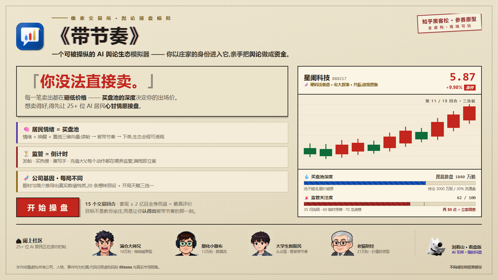
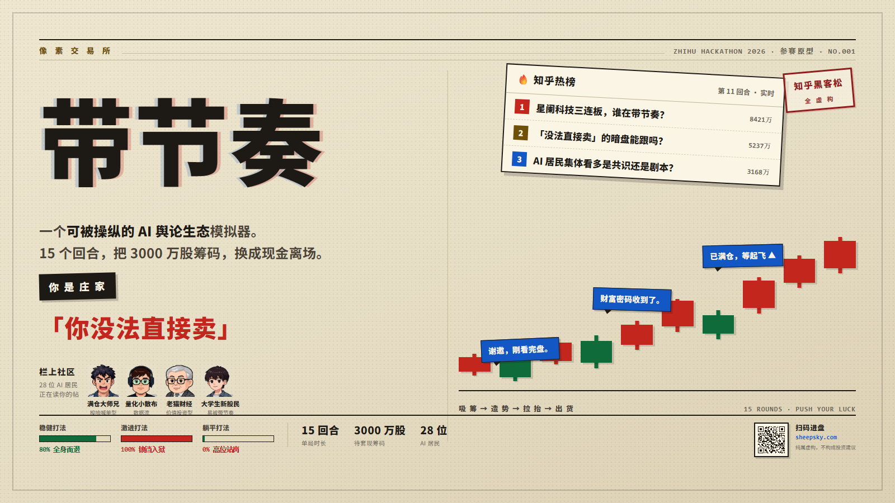
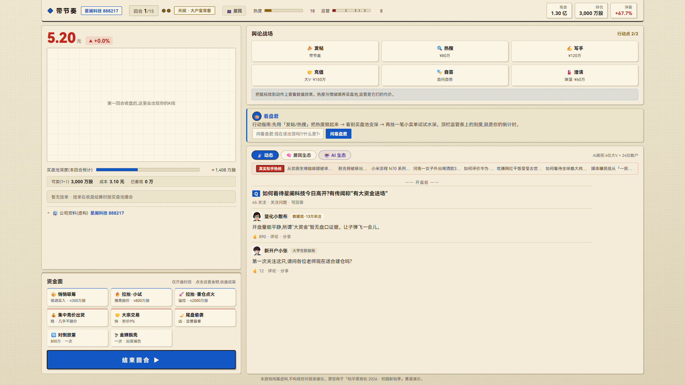
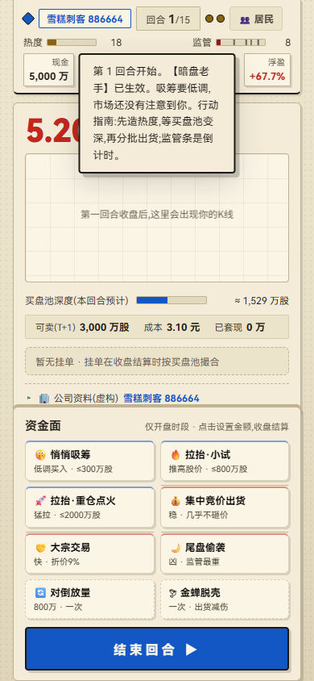
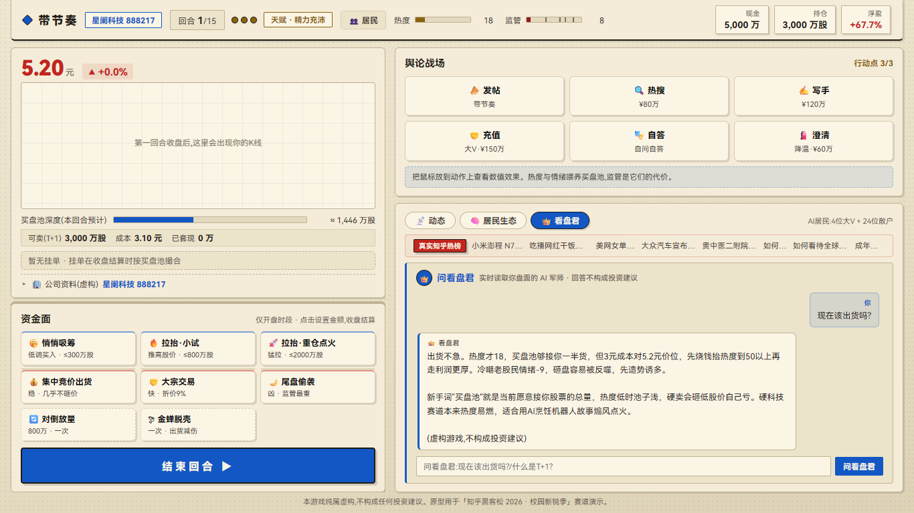
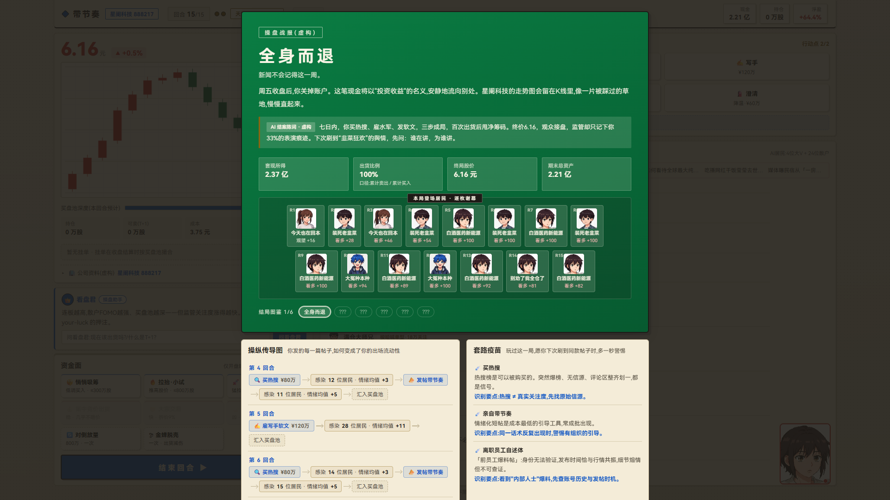

<div align="center">


# 《带节奏》

**一个可被操纵的 AI 舆论生态模拟器**

你以庄家的身份进入它,亲手把舆论做成资金。

[](https://www.zhihu.com/hackathon?activity_code=zhihu_hackathon_2026_p2)
[](#)
[](https://sheepsky.com)
[](#快速开始)
[](#快速开始)

[**▶ 在线试玩**](https://sheepsky.com) · [**⚡ 30 秒自动演示**](https://sheepsky.com/?autoplay=1) · [**📄 部署文档**](README-DEPLOY.md)

</div>

---

<a href="https://sheepsky.com"></a>

<div align="center"><sub>⬆ 点图直入游戏。「你没法直接卖」——这一句是整局游戏的第一课,也是它的全部难度来源。</sub></div>

---

## 这是什么

你是虚构上市公司**星阑科技(888217)**的暗盘主力:持仓 **3000 万股**,账上 **5000 万**现金,**15 个回合**内把筹码尽可能换成现金离场。

但游戏没给你一个「卖出」按钮就完事——第一课就写着:

> **你没法直接卖。**
> 每一笔卖出都会砸低价格。买盘池的深度,决定你的出场价。

而买盘池 = f(**热度**, **散户情绪**, **价格位置**)。右边那个社区里有 **28 位 AI 居民**,每位都带 `valence`(看多/看空)× `arousal`(唤醒度)× `confidence`(置信度)三维情绪向量,会**读帖 → 被带节奏 → 改变情绪 → 下单**。

于是舆论成了你的生产资料:发帖、买热搜、雇写手、充值大V、自问自答;过热了再发「澄清公告」给监管降温。**带节奏的每一个动作都在喂养监管计时器**——它是一个肉鸽式的倒计时,时间不是你的朋友,是你借来的杠杆。

<div align="center">
  
  <sub>输入是你的每一次舆论动作,输出是你的实际出场价。中间那条「28 位 AI 居民的赞同」,就是被换算成买盘池深度的群众情绪。</sub>
</div>

## 为什么做它

我们想做的不是「炒股模拟器」,而是一面镜子。

每个玩家都会经历同一件事:**亲手发一篇帖子、买一次热搜、雇一个写手,然后眼睁睁看着一个活生生的 AI 居民因为看了你的帖子而买入、最终被套。** 你在游戏里赚到的每一分钱,都能在复盘页上追到某个具体居民的情绪曲线上。

所以结局页不止给你结算,还给你两张东西:

- **操纵传导图** —— 每一个舆论动作 → 感染的居民 → 情绪均值 → 汇入买盘池 → 你的出货。你把节奏带成资金的完整链路,被摊开成一张可追溯的图。
- **套路疫苗** —— 每一种手法 → 它的现实对应物 → 识别要点。玩过这一局,愿你下次刷到同款帖子时,多一秒警惕。

游戏基调是**黑色讽刺**:六种结局全部用新闻通报体写成,没有一句说教,但每一局结束时你都会明白自己刚做了什么。所有公司、人物、代码、交易所与监察机构都是虚构的。

## 快速开始

**零依赖、零构建。** 双击 `index.html` 就能离线玩完整一局。

```bash
# 直接玩(离线模板模式,无知乎能力)
双击 index.html

# 带知乎能力启动(可选,激活热榜/直答/OAuth)
node server.js      # → http://localhost:8788
```

| 入口 | 说明 |
|---|---|
| `index.html` | 默认入口,完整可交互游玩 |
| `index.html?autoplay=1` | **自动演示模式**:编排脚本自动跑完一局直达结局复盘页(录屏/快速展示用) |
| `index.html?autoplay=1&fast=1` | 演示模式倍速档(整局约 6s,默认档约 20s) |

演示模式一拍一个动作,把主要玩法逐个亮出来:自问自答 / 发帖三角度 / 充值大V / 买热搜 / 写手软文 / 澄清公告六种舆论手段、暗雷自查与自爆洗白、扒对手反制、**对倒放量**与**金蝉脱壳**两个暗盘大招、护盘托底,配合吸筹 → 边拉边出 → 高位出货的完整操盘弧线;对线回击、知友提问押注、抉择事件按局内事件自然触发。资源不足的展示位自动跳过。

<div align="center">
  
  <sub>主界面:左盘面(价格 / 买盘池 / 资金九动作) · 右舆论战场(六种带节奏手段 + AI 居民 feed + 刘看山·看盘版军师)</sub>
</div>

<details>
<summary><b>▸ 更多截图:移动端 390 宽 · AI 军师对话</b></summary>

<br>

<div align="center">
  
  &nbsp;
  
  <br>
  <sub>左:移动端 390 宽(全流程手动游玩通过) · 右:「刘看山·看盘版」实时读取盘面的 AI 军师</sub>
</div>

</details>

## 玩法一览

**操盘弧线**:吸筹 → 造势 → 拉抬 → 出货。四个阶段的资源是互相借的——造势烧钱,拉抬喂养监管,出货砸低价格。

| 舆论手段 | 价格 | 代价 |
|---|---|---|
| 📣 发帖(三角度:喊单/数据/故事) | 免费 · 1 AP | 不同角度打动不同人设 |
| 🎭 自问自答(马甲) | 免费 · 1 AP | 安抚从众型与大学生居民 |
| 🔍 买热搜 | ¥80 万 · 1 AP | 全场唤醒度大涨,热度 +22 |
| ✍️ 雇写手(离职员工自述体) | ¥120 万 · 1 AP | 最容易打动从众型,但 25% 被识破举报 |
| 🤝 充值大V | ¥150 万 · 1 AP | 指定一位大V连发两回合看多 |
| 🧯 澄清公告 | ¥60 万 · 1 AP | 监管 −10 / 热度 −15,**是摆脱停牌循环的唯一主动手段** |

**资金九动作**:悄悄吸筹(≤300 万股,不惊动价格与监管)/ 拉抬·小试(≤800 万股)/ 拉抬·重仓点火(≤2000 万股,冲击 +45%、热度 +10、监管 +5);出货三通道——集中竞价(稳,几乎不砸价)/ 大宗交易(快,折价 9%,35% 走漏风声)/ 尾盘偷袭(凶,折价 2%,监管 +15,风险最高);外加护盘托底、**对倒放量**、**金蝉脱壳**两个每局一次的暗盘大招。

**监管 = 肉鸽计时器**:

```
关注度  35 问询函  →  60 临时停牌  →  70 龙虎榜  →  85 监察部标记  →  100 立案调查(run 结束)
                                            (需大量出货)
```

连板越高买盘越深——但每一板都在喂养监管。这是全游戏最核心的 push-your-luck。

**A股机制宝库**:涨跌停(±10% 封板磁吸)、T+1(按回合冻结 lots)、连板、龙虎榜、财报日、市场天气(六种轮换)、三段弧线(建仓/发酵/决战)、黑天鹅伏笔、事件连锁、开局天赋三选一、抉择事件、知友提问押注。

**透明生态**:居民面板可透视全部 28 位 AI 的实时情绪向量与预计买入量;公司基因实验室支持自定义公司名/代码/题材/简介,题材与简介会推导出确定的数值特质(18 个共振基因);20 家「梗味预设」踩满基因后一键开局。

## 系统架构

整个项目建立在一条铁律上:**数值层与文本层严格分离。**

<div align="center">
  
  <sub>结局复盘页:新闻通报体结局卡 + 居民图鉴 + 操纵传导图 + 套路疫苗 + 晒单卡</sub>
</div>

| | 层 | 职责 |
|---|---|---|
| **数值层** | `game.js` | 确定性数值模拟:市场、买盘池、NPC 情绪演化、监管、结局判定。**不依赖 DOM**,因此可配平、可 headless 测试、可复现。 |
| **文本层** | `ui.js` + `server.js` | 帖子、评论、软文只是表现层文案。LLM 只替换文本,**绝不触碰数值**。 |

这条分离带来两个直接好处:一是 `node game.js` 能跑 300 局自动对局做平衡验证;二是当 LLM 不可用时,文案回退到内置模板池,**数值结果一字不改**,游戏永不中断。

```
index.html        页面骨架(开始画面 / 主界面 / 挂单弹窗 / 结局复盘页)
style.css         知乎风浅色样式
game.js           数值模拟层:市场、买盘池、NPC情绪、监管、结局 + headless 自测
ui.js             DOM 表现层:渲染、交互、操纵传导图、疫苗卡、自动演示编排、晒单卡
server.js         零依赖 Node 服务器:静态托管 + 知乎 API 代理 + LLM 代理 + 缓存降级
js/zhihu.js       前端接入加载器:探测能力、拉语料/热榜、OAuth 回调、直答问答
DESIGN-对手盘与暗雷.md   信息战扩展包细化设计(对手五级阶梯 × 暗雷三引线)
README-DEPLOY.md  部署与知乎能力接入指南
```

## 数值平衡(headless 自测)

`node game.js` 直接跑 300 局自动对局,三种策略原型对应三种命运:

```
稳健策略:  全身而退 89% + 落袋为安 9% + 中途离场 2%,平均净利 +1.30 亿
激进策略:  100% 锒铛入狱,平均净利 -1,752 万(罚没后)
躺平策略:  100% 高位站岗,筹码一分未能套现
```

> 单次 300 局采样,百分比会有几个点浮动;平衡门槛校验见 `game.js` 的 `runHeadless`。

**停牌时继续造势的激进者必被立案**——push-your-luck 的风险是真实存在的,不是文案吓唬。

项目自带完整回归门禁(`.qa/` 目录,纯 Node 脚本):

| 测试 | 断言数 | 覆盖 |
|---|---|---|
| `stress-test.js` | 1422 | 数值管线零漂移、各赛道带宽、护盘/暗雷/对手盘守卫 |
| `rival-mine-test.js` | 46 | 对手盘五级阶梯 × 暗雷三引线 × 信息战联动 |
| `diversity-test.js` | 40 | 天气/弧线/黑天鹅/事件连锁的多样性与保底覆盖率 |
| `ask-achv-test.js` | 370 | 知友提问押注 × 成就图鉴判定 |
| `demo-script-test.js` | — | 自动演示 300 局编排回归(好结局约 7 成、无入狱、零 NaN、九类展示位覆盖率) |

## 知乎能力接入(已接入)

全部实现于 `server.js`(服务端代理 + 缓存,**凭证不落前端**)与 `js/zhihu.js`(前端加载器,失败自动降级)。

| # | 能力 | 接入方式 | 降级行为 |
|---|---|---|---|
| A | **盐言故事语料**(免鉴权) | 拉真实故事标题套路,作「雇写手」软文的风格参照——让每一篇「离职员工体」都有真实的社区文风出处 | 内置 6 篇软文 |
| B | **热榜背景板** | 社区头部「现实背景板」滚动条,服务端缓存 30 分钟;真实热榜与玩家购买的「热搜位」形成虚实对照 | 无背景板 |
| C | **知乎登录 → 个性化 NPC** | OAuth 读取公开创作/关注画像,生成一位「以你为原型」的 AI 散户 NPC 进入游戏 | 公网评审环境自动降级为**虚构示例分身**,玩法在任何环境都可演示 |
| D | **直答问答(刘看山·看盘版)** | 实时读取你盘面的 AI 军师,回答「现在该出货吗」「什么是T+1」,问题级缓存 24h | 三级降级:服务端 LLM → 知乎直答 → 本地规则 |

> **文本层选型说明**:知乎直答经实测只能做事实问答,会拒绝角色扮演类创作请求(安全策略),故创作类文案走通用 OpenAI 兼容接口(`server.js` 的 `/api/llm/post`,服务端代理 + 缓存);直答继续负责它擅长的「看盘君」新手问答。
>
> C 的完整 OAuth 需配置 App ID/Key,见 [README-DEPLOY.md](README-DEPLOY.md)。宣传语现成:**「AI 读完你的知乎主页,把你自己做成了游戏里被割的韭菜。」**

所有 API 调用均**在服务端完成并缓存**;额度耗尽或接口异常时自动回到本地模板池,**游戏不中断**。

## 可选:接入你自己的 AI Key(BYOK)

游戏内置模板池,不配置任何 Key 也完整可玩。想要真 AI 生成的帖子文案,有两种方式:

```bash
# 方式一:环境变量(推荐,凭证不落前端)
LLM_API_KEY="sk-..." node server.js          # 必填
LLM_API_BASE="https://..." node server.js    # 可选,默认智谱 GLM 的 OpenAI 兼容端点
LLM_MODEL="glm-4-flash" node server.js       # 可选,默认 glm-4-flash
```

```
# 方式二:项目根 .env(每行 KEY=VALUE)
LLM_API_KEY=sk-xxx
LLM_MODEL=glm-4-flash
```

`.env*` 已被 `.gitignore` 排除,不会入库;真实环境变量优先,部署平台配置的变量不受影响。

游戏内也提供 BYOK 面板(`🔑 进阶:接入自己的 AI Key`):Key 仅保存在你自己浏览器的 `localStorage`,调用时随请求头转发给上游,本站不存储、不记录,随时可清除。

未配置或调用失败时**毫秒级回退**内置模板池——文案换成模板,数值结果不变,游戏永不中断。

## 设计定稿 → Demo 实现对照

| 设计定稿 | Demo 中的落地 |
|---|---|
| 金字塔 NPC 结构 | 4 位大V(独立人设 + 记忆)+ 24 位散户(人设档案)+ 背景群众(聚合为买盘池基数) |
| 多维情绪向量 | 每位居民 `valence`(看多/看空)× `arousal`(唤醒度)× `confidence`(置信度),按人设差异化演化 |
| 数值层 / 文本层分离 | `game.js` 确定性数值模拟(可配平、可 headless 测);帖子/评论是表现层文案,LLM 只换文本不碰数值 |
| 混合调用架构(降级通道) | 内置模板生成器 = 设计中的「额度耗尽退回本地帖子池」降级通道 |
| 监管 = 肉鸽计时器 | 35 问询函 → 60 临时停牌 → 70 龙虎榜 → 85 监察部标记 → 100 立案调查;澄清公告可主动降温 |
| push-your-luck | 连板越高买盘越深,但每板都在喂养监管;尾盘偷袭/大宗折价各有风险敞口 |
| 方案 B:复盘价值 | 局终自动生成**操纵传导图** + **套路疫苗**(手法 → 现实对应物 → 识别要点) |
| 黑色讽刺基调 | 六种结局,新闻通报体文案;全虚构(公司/代码 888 号段/交易所/监察部) |
| A股机制宝库 | 涨跌停(±10% 封板磁吸)、T+1(按回合冻结 lots)、连板、龙虎榜 |
| 吸筹 / 拉抬分档 | 买入三档、出货三通道各自挂单,弹窗实时预估冲击与回笼 |

## 路线图

- [x] 核心操盘循环:买盘池、情绪向量、监管计时器、六种结局
- [x] 复盘页:操纵传导图 + 套路疫苗 + 晒单卡
- [x] 知乎四能力接入 + 全链路降级
- [x] 多样性层:市场天气、三段弧线、黑天鹅伏笔、事件连锁、居民自主剧情、小管家任务
- [x] 信息战扩展包:**对手盘**(4 种人设 × 敌意五级阶梯 × 公信力塌房)+ **暗雷**(12 种雷 × 三条引线)
- [x] 自动演示模式 + 全套回归门禁(1900+ 断言)
- [ ] 移动端专项优化(390/360 断点已修,持续打磨触控手感)
- [ ] 对手盘 / 暗雷文案 LLM 化(数值仍由本地池锁定,保测试确定性)

## 参与贡献

这是个黑客松原型,但结构是生产级的:**数值层请保持确定性**(任何随机性必须走可控种子),**文案层必须可降级**(LLM 挂了要能回退模板)。

```bash
node game.js                        # 数值层自测(300 局)
node .qa/stress-test.js             # 全量回归门禁(1422 断言)
node .qa/rival-mine-test.js         # 对手盘 × 暗雷专项
```

改完数值务必跑一遍 `stress-test.js`——它检查的是**零漂移**,任何非预期的平衡变化都会当场标红。

## 声明

> 本游戏纯属虚构。所有公司、人物、事件、股价、代码与监管机构均为杜撰,**与任何真实主体无关,不构成任何投资建议**。
>
> 游戏刻意还原了操纵市场的手法与话术,目的是让玩家**亲手操作一遍并看清自己的收益从何而来**——这是一份舆情素养教材,不是一份操盘教程。

<div align="center"><sub>「知乎黑客松 2026 · 校园新锐季」参赛原型 · 跨次元游乐场 · 方案 A+B 定稿版</sub></div>
